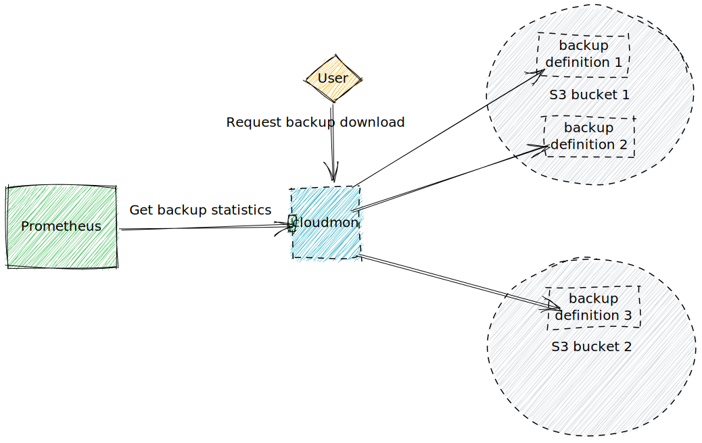

# Concept

For each of your backups, you define *backup definitions*. Those *backup definitions* define a file and/or path pattern of your backup files.
*backmon* checks each *backup definition* in a recurring interval.
All metrics from the collected backup files are aggregated and provided through a Prometheus endpoint.

