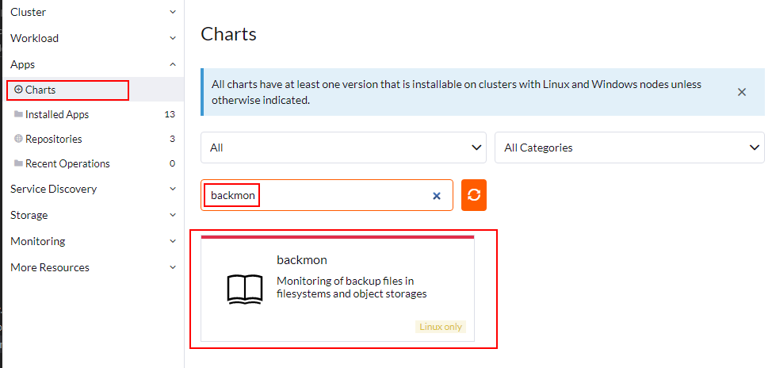

import BrowserWindow from '@site/src/components/BrowserWindow';

# Rancher app

Our [Helm chart for backmon](helm-chart) can also be deployed through Rancher apps - which is basically just a frontend for Helm.

After logging in into Rancher, select *Apps > Repositories > Create*.

<BrowserWindow>

</BrowserWindow>

Select *Target > http(s) URL to an index generated by Helm* and paste the URL `https://dreitier.github.io/helm-charts/` into it:

<BrowserWindow>

</BrowserWindow>

You can then install *backmon* by searching for it at *Apps > Charts*:

<BrowserWindow>

</BrowserWindow>
